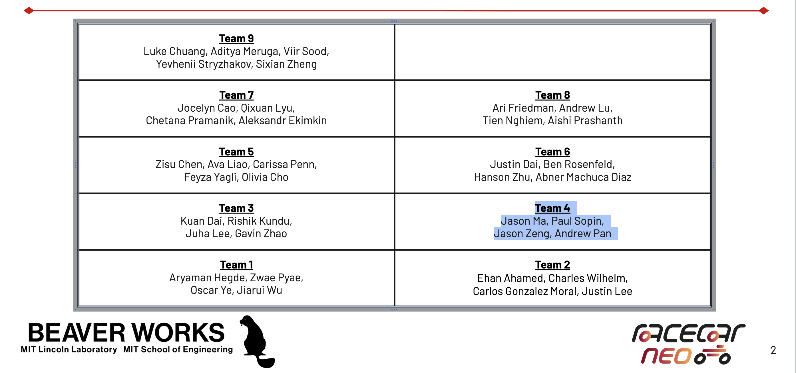
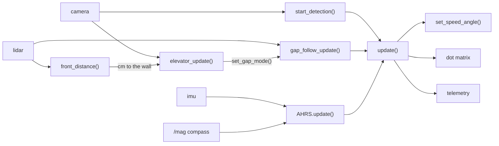
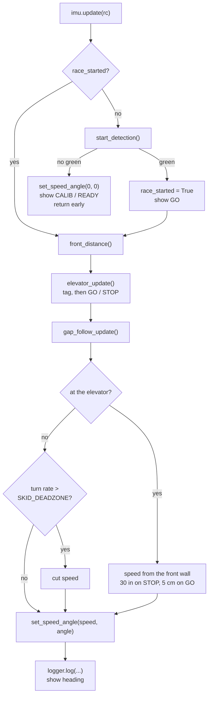

# 🏆 BWSI RACECAR 2026 - TEAM 4 - TRIPLE CROWN 🏆

## 3/3 Major Awards:

**Our team is the first in BWSI RACECAR history to win all three championships in a single year.**

| 🏆 Title | Result |
| :--- | :--- |
| **Grand Prix Champion** | 1st place in the final Grand Prix, against **14 teams** from around the world, including Japan, Greece, and Canada |
| **Time Trial Champion** | Competing against BWSI students (10 teams)  <br> **Course record: 59 seconds** |
| **Quest Log Champion** | Most CC coins earned of any team, **40 CC coins** |

### 📽️ The moment

**🎬 Our instructor announcing that we won all three awards**

https://github.com/user-attachments/assets/4e794592-f9c4-4f1c-bf4e-e365b840c9f5

**🏁 Winning the Grand Prix**

https://github.com/user-attachments/assets/ceaf3f6e-fc60-431d-9870-20f7a4df64e9

**🧑‍🤝‍🧑 The final teams**



*Team 4: Paul Sopin, Andrew Pan, Jason Ma, Jason Zeng.*

How we did it:

### Our Team

**Paul Sopin · Andrew Pan · Jason Ma · Jason Zeng**

| Member | Contributions |
| :--- | :--- |
| **Paul Sopin** | Gap follower, AR tag detection, elevator sign logic on the Coral TPU, green light start detection |
| **Andrew Pan** | Gap follower, dot matrix display |
| **Jason Ma** | Gap follower, AHRS (gyro bias calibration, heading, complementary filters, traction limiter) |
| **Jason Zeng** | Gap follower, telemetry and live debug HUD |

### Why the code won

- **Gap follower, decision matrix:** it scored 33 against EATS (pablogorithm) at 32 and midline tracking at 21, and it is what produced our 59 second record run.
- **Full AHRS with no ROS 2 stack in the hot path:** Gyro bias is measured on the line, heading is corrected by a compass complementary filter, and a traction limiter cuts speed the moment the turn rate says the car is slipping. This allows us to gain speed on the straights without throwing the run away in a corner.
- **Graceful degradation:** If the compass drops out, the AHRS falls back to gyro only and the car keeps racing. If no side gap is wide enough, the follower falls back to the largest gap.
- **Real perception:** AR tag 0 holds the elevator approach, and a Coral TPU object detector reads the elevator's GO or STOP sign live the whole way.
- **Debuggable:** Live telemetry graphs, console HUD, a dot matrix that reports calibration state and live heading, and documented tuning constants.

---

> Important note: Jason Ma's laptop broke at the start of week 4. Most of the work after that happened on Jason Zeng's laptop, which makes Github show the commit as the person whose device was used. The person that actually did the commit’s name is in the description.

Our Grand Prix code goes as follows: The Racecar sits at the line, waits for the stoplight to turn green, then runs the course on a gap follower. An AHRS node goes with it and reads heading, turn rate, and it makes sure the racecar doesn’t slip. For the elevator code, AR tag 0 on the right wall tells us the elevator is coming up on the left, and a compass keeps the heading from drifting. The elevator itself is based on the stop and go, which we run sign detection on the Coral TPU.

## Quick Start

```bash
# cd to your racecar folder first

git clone https://github.com/paul-sopin/team4-bwsiracecar-grandprix
cd team4-bwsiracecar-grandprix

# The Grand Prix winning run
racecar sim grand_prix/final_gapfollower/KISS.py

# The full integration challenge build (AHRS, AR tag, elevator, telemetry)
racecar sim grand_prix/integration-challenges/grand_prix_AHRS.py
```

At the start of the match, do not touch the racecar for 2 seconds because the gyro bias gets measured while we're sitting.

What the dot matrix shows/means:

| Shows | Means |
| :--- | :--- |
| CALIB | gyro's still calibrating |
| READY | done calibrating, waiting on green stoplight|
| GO | up for about a second once we start |
| ELV | tag 0 seen, hugging the left, watching for the sign |
| WAIT | the sign said STOP, sitting 30 inches off the wall |
| IN | the sign said GO, driving into the elevator |
| DONE | parked inside |
| -12 | that's live heading, in degrees |

Everything's simplified since the matrix is 8x24 and it scrolls anything longer at maybe two characters a second.

## Repository Layout

| Path | Purpose |
| :--- | :--- |
| grand_prix/final_gapfollower/KISS.py | **the code that won the Grand Prix and set the 59 second record** |
| grand_prix/integration-challenges/grand_prix_AHRS.py | the integration build, start detection, gap follower, traction limiter, display |
| grand_prix/integration-challenges/ahrs.py | AHRS: gyro bias calibration, heading, turn rate, roll and pitch, compass filter |
| grand_prix/integration-challenges/mag.py | reads the compass off /mag, the only ROS we touch during a race |
| grand_prix/integration-challenges/ar_detector.py | the AR tag gate before the elevator. no racecar imports |
| grand_prix/integration-challenges/elevator_signs.py | the elevator's GO / STOP sign, on the Coral |
| grand_prix/integration-challenges/best_v5_edgetpu.tflite | the weights that reads, added from the Trial 3A repo |
| grand_prix/integration-challenges/show_ar_tags.py | draws what both readers see, and prints test tags. doesn't drive |
| grand_prix/integration-challenges/telemetry.py | thin layer over rc.telemetry, plus the live debug HUD |
| documentation/documentation.md | the full write up, decision matrices and all |
| documentation/integration-challenges-progress.md | where we track Trial 4A |
| documentation/integration-challenges.png | the Trial 4A sheet itself |

---

## Architecture

We do not run a ROS 2 stack for this code since its slightly more complicated. The AHRS is a plain Python class which update() calls it directly. 

The one exception is mag.py. The compass is not on rc.physics, it part of the IMU node on the /mag topic, so that one file subscribes to it and nothing else. It is a subscriber, not a node we have to launch, and if it finds nothing there the AHRS goes back to gyro-only and the car still races.


Structure:



And one frame of update():



---

## KISS.py, the winning run
Paul Sopin, Andrew Pan, Jason Ma, Jason Zeng

[grand_prix/final_gapfollower/KISS.py](grand_prix/final_gapfollower/KISS.py) is what we actually ran in the Grand Prix and in the record 59 second time trial. Keep It Stupid Simple: 95 lines, no AHRS, no ROS, no camera, one lidar sweep per frame.

Everything else in this repo is the integration challenge build. When it came to the race we cut the car down to the part that made it fast, because every subsystem in the loop is another thing that can fail on the one run that counts.

What it does per frame:

- Sweeps -60 to +70 degrees and marks anything past OPEN_THRESHOLD as open. A 0.0 reading counts as open too, since the lidar returns 0.0 for out of range rather than far away.
- Collects the open stretches and throws out anything narrower than MIN_GAP_WIDTH, so noise at the edge of the scan can't become a target.
- **The tiebreak is the trick.** Instead of just taking the widest gap, it keeps every gap within TIE_RATIO (60%) of the widest and then picks the rightmost of those. When two gaps are close in size, committing to a side beats splitting the difference and clipping the divider.
- Steers proportional to the middle of that gap, GAP_TURN_KP times the target angle, clamped to the wheel range.
- Speed comes from the average of the furthest left and furthest right readings, so open room means throttle and tight room means brakes, floored at MIN_SPEED 0.7 so it never crawls.
- If the lidar hands back an empty scan it goes MAX_SPEED rather than stopping. On this course a dropped frame means keep going.

## Gap Follower (integration build)
Paul Sopin, Andrew Pan, Jason Ma, Jason Zeng

Our gap follower reads the lidar readings from -90 to 90. Anything past the OPEN_THRESHOLD is open, and the largest open gap is selected, and the car steers at the middle of that run. Speed is calculated from the average of the furthest left and right readings, which means it is really fast on straights, but slows down during turns (it is basically an EATS controller).

We decided to use a gap follower based on a decision matrix against Midline Tracking and EATS. Scored on speed, consistency, ease to code, efficiency:

- Gap Follower: 33
- EATS: 32
- Midline Tracking: 21

Two versions of the follower exist. V1 was written before Speed Quest and splits the logic over separate functions. Even though it is nicer to read, it is harder to edit. V2 got written during the Speed Quest.

### Gap modes

By default it takes the largest gap it can find. set_gap_mode() switches that to leftmost or rightmost, which forces the car to one side of the course instead. That is for the fork dynamicobstacle.

The side modes skip gaps narrower than MIN_GAP_WIDTH degrees. Without that, leftmost will steer at a one degree gap of noise at the edge of the scan. If nothing on that side is wide enough it falls back to the largest gap. largest skips the check completely, so it behaves the original gap follower.

## AR Tag Detection
Paul Sopin

Tag 0 is taped to the right wall just before the elevator, but the elevator is on the left. The tag is something to look at, not somewhere to drive, so seeing it calls set_gap_mode("leftmost") and turns the sign reader on.

The course has five tags, 0 through 4, all 6x6. Only 0 is ours, so AR_IDS is (0,) and the other four are thrown out. Leave that as None and the first tag the car drives past sends it looking for an elevator that isn't there. AR_DICT stays DICT_6X6_250 because the 6x6 dictionaries share their first markers, so it reads a tag printed from 6X6_50 or 6X6_100 just the same.

That makes this much simpler than what we had at the fork, where a tag's orientation picked left or right.

## The Elevator
Paul Sopin

Once we get past the tag, the elevator shows a sign and we do what it says:

| Sign | What we do |
| :--- | :--- |
| STOP | wait 30 inches (HOLD_DIST_CM) off the wall |
| GO | drive in until the wall is ENTER_DIST_CM away, then park |

We keep reading the sign the whole way in, since the board shows STOP first and GO later and we have to go into the elevator during the time when the sign says go. If a STOP sign is shown it stops in front of the sign just outside of the elevator.


```bash
sudo kill $(sudo lsof -t /dev/apex_0)
sudo lsof /dev/apex_0          # blank means it is free
```


One thing to know about ENTER_DIST_CM is that the lidar cannot actually see 5 cm. Its minimum range is somewhere around 15 and under that the samples come back 0.0, which racecar_utils reads as no data. So we call it arrived when the front goes blank right after reading something shorter than LIDAR_BLIND_CM. 

To check both before a run:

```bash
cd grand_prix/integration-challenges

# no tag handy? print one and tape it up
python3 show_ar_tags.py --make-tag 0

# what the car sees
python3 show_ar_tags.py --racecar --http

# same, with the Coral running too
python3 show_ar_tags.py --racecar --http --signs
```


## Start Detection
Paul Sopin

Crop down to the middle and lower part of the frame so the sky is gone, and it reads the  HSV threshold for green inside that crop. It then takes the biggest contour and measures the area. It returns True on two conditions: there's a green contour, and the contour is bigger than START_AREA_THRESHOLD.

## Dot Matrix
Andrew Pan

When race_started is False, the camera reads start_detection(). If the green contour is big enough, then race_started becomes True, and GO appears on the screen. No green: set_speed_angle(0, 0), display shows whatever the calibration state is, return early.

For a while it just said NOT STARTED. However, we added CALIB to see when the IMU is calibrating, which is very important so we know when the IMU is finished calibrating.

## Telemetry
Jason Zeng

We decided on a graph of error over time for our telemetry system.

The other idea we had was downloading full LIDAR and camera to disk and rebuilding entire runs offline. The issue was this is that we did not have enough time to develop this, and it lags the system too much while running.

telemetry.py is a helper for the built in rc.telemetry. log() which puts fields into FIELD_ORDER, passes them to rc.telemetry.record(), and the graph shows up when the script exits. Gap angle, both wall distances, steering angle, speed, heading, turn rate and gap bias are all logged. Gap bias is the gap mode as a number, -1 for leftmost, 0 for largest, 1 for rightmost, so on the graph you can line it up against the steering angle and see whether a tag fired where you expected it to.

draw_hud() prints out the target angle, steering angle, speed, and a bar for where the controller is pointing in the consoler.

## AHRS
Jason Ma

For the first two seconds we average the gyro bias, then subtract it off every sample from then on. A gyro that is completely motionless still has a bit of drift, and the more we integrate that the more the heading drifts.

Yaw: integrate yaw rate, turn it into -pi to pi. It's relative and not absolute (it starts at 0 at calibration).

Roll and pitch it calculated through a complementary filter. Gyro is smooth, and it drifts. Gravity is noisy, and it doesn't. ACCEL_TRUST sits at 0.02. We tried higher, it got jittery.

### Compass, for yaw

Gravity pulls roll and pitch straight every frame. Nothing in an accel and gyro IMU knows which way is north, so yaw is pure integration and it drifts a lot. The compass is the only sensor on the car that can correct it, so we use the same complementary filter we used for the pitch and roll: 98% of the gyro, 2% of the compass, MAG_TRUST set to 0.02 for the same reason ACCEL_TRUST is.

The compass is not on rc.physics, instead it is an LSM9DS1 on the /mag topic, which is what mag.py is for. These are what is needed for the filter:

- Same frame. Gyro yaw is relative to startup, compass heading is relative to north. At lock in we record the offset between them, so yaw keeps meaning degrees from wherever we started and the logs don't change meaning halfway through a run.
- Same direction. If the compass reads mirrored the correction would push yaw the wrong way.


### Traction limiter

Speed comes from open distance ahead, which means the gap follower will carry all of it into a corner. If the turn rate is higher than normal turning should be able to produce, we call it a slip, and we  cut speed in proportion to how far over the line it is.

SKID_DEADZONE is how much turning is considered to be normal. Of every constant in here, it's the one that needs the most tuning.

## Tuning

| Constant | File | Effect |
| :--- | :--- | :--- |
| OPEN_THRESHOLD | grand_prix_AHRS.py | how far away still counts as open space |
| GAP_TURN_KP | grand_prix_AHRS.py | how hard it yanks toward the gap |
| MIN_SPEED / MAX_SPEED | grand_prix_AHRS.py | speed envelope |
| SKID_DEADZONE | grand_prix_AHRS.py | turn rate we're still willing to call cornering |
| SKID_KD | grand_prix_AHRS.py | brake strength per deg/s over that |
| CALIB_FRAMES | ahrs.py | calibration length. has to finish before green |
| ACCEL_TRUST | ahrs.py | accelerometer weight in roll/pitch |
| MAG_TRUST | ahrs.py | compass weight in yaw. same idea as ACCEL_TRUST |
| MAG_OFFSET | ahrs.py | hard iron offset. fill it in to skip the calibration circle |
| MIN_GAP_WIDTH | grand_prix_AHRS.py | narrowest gap the side modes will aim at |
| AR_IDS | grand_prix_AHRS.py | which tags count. (0,) is the elevator. None would let 1 to 4 fire it too |
| AR_DICT | grand_prix_AHRS.py | which AR dictionary the course tag comes from |
| AR_MIN_SIZE | grand_prix_AHRS.py | smallest tag we act on, so really the trigger distance |
| AR_NEED | grand_prix_AHRS.py | frames in a row before the tag counts |
| SIGN_NEED | grand_prix_AHRS.py | evidence before we act on GO or STOP. lower reacts sooner and trusts less |
| SIGN_TRIGGER_H | grand_prix_AHRS.py | sign size worth a full vote, so the distance we read it from |
| HOLD_DIST_CM | grand_prix_AHRS.py | where we wait on STOP. 76.2 is 30 inches |
| ENTER_DIST_CM | grand_prix_AHRS.py | where we stop on GO |
| LIDAR_BLIND_CM | grand_prix_AHRS.py | how short a reading has to be before a blank one means we arrived |
| ELEV_KP / ELEV_MAX_SPEED | grand_prix_AHRS.py | how fast we close on the wall |
| CLASS_ROW | elevator_signs.py | which model output row is GO and which is STOP |

Once a second, update_slow() dumps speed, angle, wall distances, the race state, the front distance, what both readers are sitting on, the compass state, heading, turn rate, roll and pitch. To set AR_MIN_SIZE or SIGN_TRIGGER_H, run show_ar_tags.py --racecar --signs, walk the car back until sz drops under the number you are trying, and measure the floor. To set SKID_DEADZONE: drive a lap clean, watch the Turn rate line, put the deadzone a little over the biggest number honest cornering produced. Set it low and the car brakes in every corner. Set it high and you get the slide you were trying to prevent.

---

## Trial 4A Integration Challenges

| # | Challenge | Status |
| :--- | :--- | :--- |
| 1 | Waiting state, green light start | done, grand_prix_AHRS.py |
| 2 | Dot Matrix Display utility | done. calibration state, run state, live heading |
| 3 | Novel telemetry or debugging sequence | done. telemetry.py, live HUD, graph after the run |
| 4 | AHRS node or heading parameters | done, ahrs.py, and the Trial 2D ROS package too |
| 5 | G-Splat with RealSense 435i | no |
| 6 | Occupancy grid of the track | no |
| 7 | Object detector influencing decisions | done. the Coral reads the elevator's GO / STOP sign and the car obeys it |
| 8 | Dynamic obstacle traversal | done. leftmost / rightmost gap modes drive the fork |
| 9 | New sensor under $100 | no |

More detail in [documentation/integration-challenges-progress.md](documentation/integration-challenges-progress.md), and the full write up is in [documentation/documentation.md](documentation/documentation.md).

---


