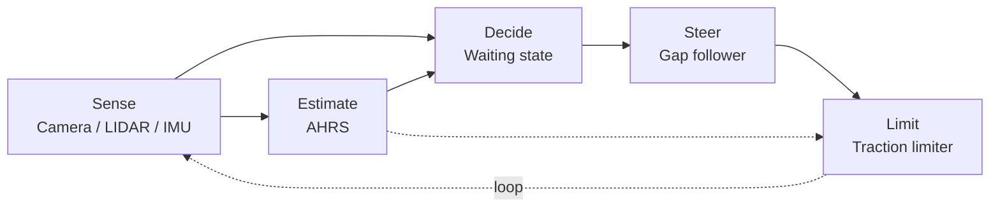
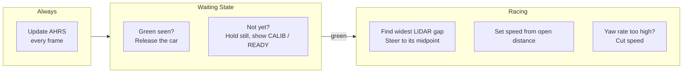

# BWSI 2026 RACECAR — Team 4 Grand Prix

> **On authorship:** most of this was written on **Jason Zeng's computer**, because Jason Ma's computer broke. Git blames the machine's owner, not the author. **Check the commit description — whoever actually made the commit is named there.**

The car sits still until it sees green. Then it drives the course by aiming at the largest gap the LIDAR can find, while an onboard AHRS watches how fast it is rotating and eases off the throttle when it starts to slide.

## Quick Start

```bash
# cd to your racecar folder first

git clone https://github.com/paul-sopin/team4-bwsiracecar-grandprix
cd team4-bwsiracecar-grandprix

# Run on the car
racecar sim grand_prix/grand_prix_AHRS.py
```

Watch the dot matrix. It reads `CALIB` while the gyro measures its own bias, `READY` when that finishes, `STARTED` when green trips the gate, and after that the live heading in degrees.

> **Do not touch the car for the first two seconds.** The gyro bias is measured entirely during the wait at the light. Bump the car in that window and every heading for the rest of the run inherits the error.

## Repository Layout

| Path | Purpose |
| :--- | :--- |
| `grand_prix/grand_prix_AHRS.py` | The race script: waiting state, gap follower, traction limiter, display |
| `grand_prix/ahrs.py` | The AHRS: bias calibration, heading, turn rate, roll and pitch |
| `integration-challenges-progress.md` | Trial 4A tracker |
| `integration-challenges.png` | The Trial 4A sheet |

---

## Architecture

One process, one file, no ROS. The AHRS is a plain Python class the update loop calls directly — not a node, not a topic, not a second thing to launch at the start line. Team 4 does have a real ROS AHRS in the `state_estimation` package from Trial 2D, and it is the better estimator. It is also a colcon build and a launch file away from running, which is why it does not race.



### Frame logic



**Waiting state.** A green contour larger than `START_AREA_THRESHOLD` in the cropped camera frame releases the car. The crop throws away the top third of the image so ceiling lights cannot pass for a stoplight.

**Gap follower.** Sweeps the LIDAR one degree at a time from −90° to +90°, keeps the longest unbroken run of open space, and steers at that run's midpoint. Speed comes from average open distance, so it accelerates into straights on its own.

**AHRS.** Averages 120 frames of gyro at rest to find the bias, subtracts it forever after, and integrates what is left into heading. Roll and pitch blend gyro against gravity, and the gravity correction is skipped whenever total acceleration strays more than 2 m/s² from 9.81 — under braking or impact, "down" is a lie.

**Traction limiter.** The gap follower picks speed from what it sees. It has no idea whether the tires are holding. The AHRS does: yaw rate past `SKID_DEADZONE` means the car is rotating faster than a normal corner explains, so speed drops in proportion to the excess.

## Tuning

| Constant | File | Effect |
| :--- | :--- | :--- |
| `OPEN_THRESHOLD` | `grand_prix_AHRS.py` | Distance that counts as open space |
| `GAP_TURN_KP` | `grand_prix_AHRS.py` | Steering gain toward the gap |
| `MIN_SPEED` / `MAX_SPEED` | `grand_prix_AHRS.py` | Speed envelope |
| `SKID_DEADZONE` | `grand_prix_AHRS.py` | Yaw rate treated as ordinary cornering |
| `SKID_KD` | `grand_prix_AHRS.py` | Braking per °/s of excess yaw |
| `CALIB_FRAMES` | `ahrs.py` | Calibration length; must finish before green |
| `ACCEL_TRUST` | `ahrs.py` | Accelerometer weight in roll and pitch |

`update_slow()` prints speed, angle, wall distances, heading, turn rate, roll and pitch once a second. To set `SKID_DEADZONE`, drive a clean lap, read the `Turn rate:` line, and put the deadzone just above the highest number normal cornering produces.

---

## Trial 4A Integration Challenges

| # | Challenge | Status |
| :--- | :--- | :--- |
| 1 | Waiting state, green light start | ✅ `grand_prix_AHRS.py` |
| 2 | Dot Matrix Display utility | ✅ Calibration state, run state, live heading |
| 3 | Novel telemetry / debugging sequence | ✅ Run logs, record-and-playback, bench harness |
| 4 | AHRS node or heading parameters | ✅ `ahrs.py`, plus the Trial 2D ROS package |
| 5 | G-Splat with RealSense 435i | ❌ Not attempted |
| 6 | Occupancy grid of the track | ❌ Not attempted |
| 7 | Object detector influencing decisions | ⚠️ Built for Trial 3A, never wired into the race |
| 8 | Dynamic obstacle traversal | ❌ Attempt on race day |
| 9 | New sensor under $100 | ❌ Not attempted |

> See [integration-challenges-progress.md](integration-challenges-progress.md)

---

## Side Notes

- **This code has not been run.** It was written and reviewed on a machine with no Python installed, so it has never been executed, let alone driven. Nothing below is a measurement.
- **`SKID_DEADZONE = 25.0` and `SKID_KD = 0.0022` are guesses.** Nobody has read a real turn rate off this car yet. Set too low, the limiter brakes in every corner and costs lap time.
- **The traction limiter is cruder than its name.** It thresholds the raw magnitude of yaw rate, so it cannot tell a slide from a tight hairpin — both get braked. Proper stability control compares measured yaw against what steering angle and speed predict. Ours does not.
- **Heading is relative.** No magnetometer, so yaw counts from wherever the car happened to point at startup, not from north. The Trial 2D `attitude_node` has a compass. It is not the thing racing.
- **Heading does not steer anything.** The limiter uses turn rate. Heading goes to the display and the console and nowhere else.
- **Challenge #7 is one import away.** `sign_detection/sn.py` already classifies signs and lights and acts on them. It just lives in the other repo and nothing here calls it.
- `PABLO_TURN_KP`, `left_angle` and `right_angle` are dead. The last two print `0.0` every second forever.
