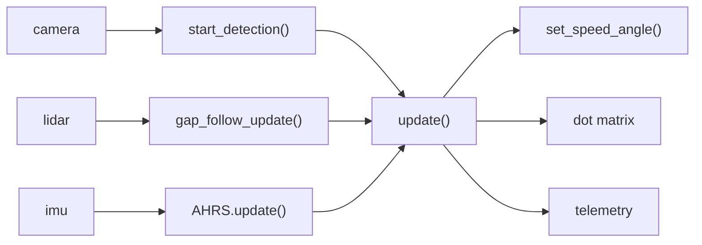
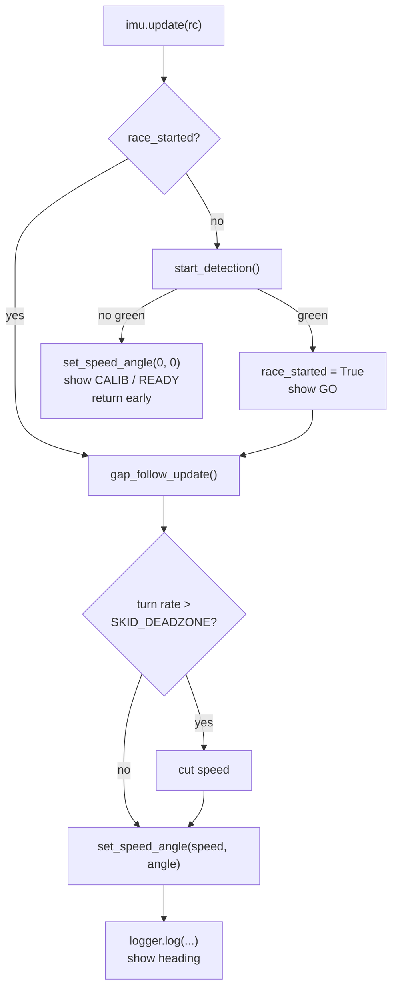

# BWSI RACECAR 2026 - TEAM 4 GRAND PRIX

> Important note: Jason Ma's laptop broke at the start of week 4. Most of the work after that happened on Jason Zeng's laptop, which makes Github show the commit as the person whose device was used. The person that actually did the commit’s name is in the description.

Our Grand Prix code goes as follows: Car sits at the line, waits for the stoplight to turn green, then runs the course on a gap follower. An AHRS node goes with it and reads heading, turn rate, and it makes sure the racecar doesn’t slip.

## Quick Start

```bash
# cd to your racecar folder first

git clone https://github.com/paul-sopin/team4-bwsiracecar-grandprix
cd team4-bwsiracecar-grandprix

# Run on the car
racecar sim grand_prix/grand_prix_AHRS.py
```

At the start of the match, do not touch the racecar for 2 seconds. Gyro bias gets measured while we're sitting at the light.

What the dot matrix shows/means:

| Shows | Means |
| :--- | :--- |
| CALIB | gyro's still calibrating |
| READY | done calibrating, waiting on green stoplight|
| GO | up for about a second once we start |
| -12 | that's live heading, in degrees |

Everything's simplified since the matrix is 8x24 and it scrolls anything longer at maybe two characters a second, which is no use at all once the car is moving.

## Repository Layout

| Path | Purpose |
| :--- | :--- |
| grand_prix/grand_prix_AHRS.py | the race script, start detection, gap follower, traction limiter, display |
| grand_prix/ahrs.py | AHRS: gyro bias calibration, heading, turn rate, roll and pitch |
| grand_prix/telemetry.py | thin layer over rc.telemetry, plus the live debug HUD |
| integration-challenges-progress.md | where we track Trial 4A |
| integration-challenges.png | the Trial 4A sheet itself |

---

## Architecture

We do not plan on using ROS 2 for this code.

The AHRS is a plain Python class which update() calls it directly. Nothing extra to start when you're standing at the line and the light is about to change.

There is a real ROS 2 AHRS, which is state_estimation, from Trial 2D. Even though trial 2D’s estimator is slightly more accurate, it also wants a colcon build and a launch file already running before it gives us any reading.

What reads what:



And one frame of update():



---

## Gap Follower
Andrew Pan, Jason Ma, Jason Zeng

Reads the lidar readings from -90 to 90. Anything past the OPEN_THRESHOLD is open, and the largest open gap is selected, and the car steers at the middle of that run. Speed is calculated from the average of the furthest left and right readings, which means it is really fast on straights, but slows down during turns (it is basically an EATS controller).

We decided to use a gap follower based on a decision matrix against Midline Tracking and EATS. Scored on speed, consistency, ease to code, efficiency:

- Gap Follower: 33
- EATS: 32
- Midline Tracking: 21

Two versions of the follower exist. V1 came before Speed Quest and splits the logic over separate functions. Even though it is nicer to read, it is harder to edit. V2 got written during the Speed Quest.

## Start Detection
Paul Sopin

Crop down to the middle and lower part of the frame so the sky is gone, and it reads the  HSV threshold for green inside that crop. It then takes the biggest contour and measures the area. It returns True on two conditions: there's a green contour, and the contour is bigger than START_AREA_THRESHOLD.

## Dot Matrix
Andrew Pan

When race_started is False, the camera reads start_detection(). If the green contour is big enough, then race_started becomes True, and GO appears on the screen. No green: set_speed_angle(0, 0), display shows whatever the calibration state is, return early.

For a while it just said NOT STARTED. However, we added CALIB to see when the IMU is calibrating, which is very important so we know when the IMU is finished calibrating.

## Telemetry
Jason Zeng

We decided on a graph of error over time for our telemetry system.

The other idea we had was downloading full LIDAR and camera to disk and rebuilding entire runs offline. The issue was this is that we did not have enough time to develop this, and it lags the system too much while running.

telemetry.py is a helper for the built in rc.telemetry. log() which puts fields into FIELD_ORDER, passes them to rc.telemetry.record(), and the graph shows up when the script exits. Gap angle, both wall distances, steering angle, speed, heading, turn rate are all logged.

draw_hud() prints out the target angle, steering angle, speed, and a bar for where the controller is pointing in the consoler.

## AHRS
Jason Ma

For the first two seconds we average the gyro bias, then subtract it off every sample from then on. A gyro that is completely motionless still has a bit of drift, and the more we integrate that the more the heading drifts.

Yaw: integrate yaw rate, turn it into -pi to pi. It's relative and not absolute (it starts at 0 at calibration).

Roll and pitch it calculated through a complementary filter. Gyro is smooth, and it drifts. Gravity is noisy, and it doesn't. ACCEL_TRUST sits at 0.02. We tried higher, it got jittery.

### Traction limiter

Speed comes from open distance ahead, which means the gap follower will carry all of it into a corner. If the turn rate is higher than normal turning should be able to produce, we call it a slip, and we  cut speed in proportion to how far over the line it is.

SKID_DEADZONE is how much turning is considered to be normal. Of every constant in here, it's the one that needs the most tuning.

## Tuning

| Constant | File | Effect |
| :--- | :--- | :--- |
| OPEN_THRESHOLD | grand_prix_AHRS.py | how far away still counts as open space |
| GAP_TURN_KP | grand_prix_AHRS.py | how hard it yanks toward the gap |
| MIN_SPEED / MAX_SPEED | grand_prix_AHRS.py | speed envelope |
| SKID_DEADZONE | grand_prix_AHRS.py | turn rate we're still willing to call cornering |
| SKID_KD | grand_prix_AHRS.py | brake strength per deg/s over that |
| CALIB_FRAMES | ahrs.py | calibration length. has to finish before green |
| ACCEL_TRUST | ahrs.py | accelerometer weight in roll/pitch |

Once a second, update_slow() dumps speed, angle, wall distances, heading, turn rate, roll and pitch. To set SKID_DEADZONE: drive a lap clean, watch the Turn rate line, put the deadzone a little over the biggest number honest cornering produced. Set it low and the car brakes in every corner. Set it high and you get the slide you were trying to prevent.

---

## Trial 4A Integration Challenges

| # | Challenge | Status |
| :--- | :--- | :--- |
| 1 | Waiting state, green light start | done, grand_prix_AHRS.py |
| 2 | Dot Matrix Display utility | done. calibration state, run state, live heading |
| 3 | Novel telemetry or debugging sequence | done. telemetry.py, live HUD, graph after the run |
| 4 | AHRS node or heading parameters | done, ahrs.py, and the Trial 2D ROS package too |
| 5 | G-Splat with RealSense 435i | no |
| 6 | Occupancy grid of the track | no |
| 7 | Object detector influencing decisions | built it for Trial 3A, never wired into the race |
| 8 | Dynamic obstacle traversal | going for it race day |
| 9 | New sensor under $100 | no |

More detail in [integration-challenges-progress.md](integration-challenges-progress.md).

---

## Known Issues
- Challenge 7 is close. Added AR tag detector to recognize tags.
