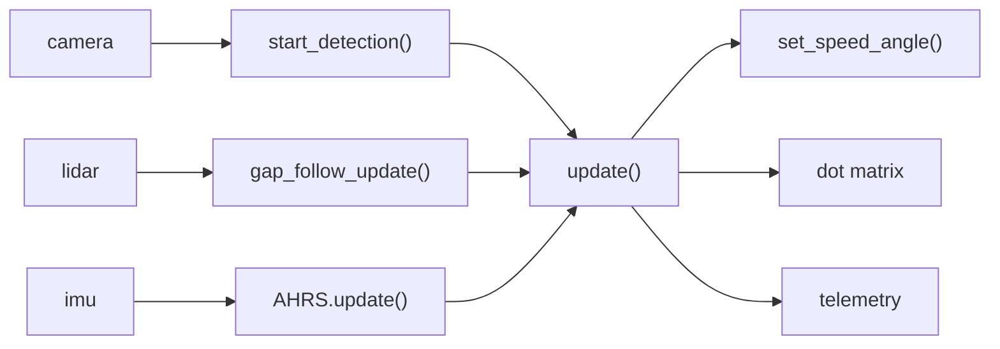
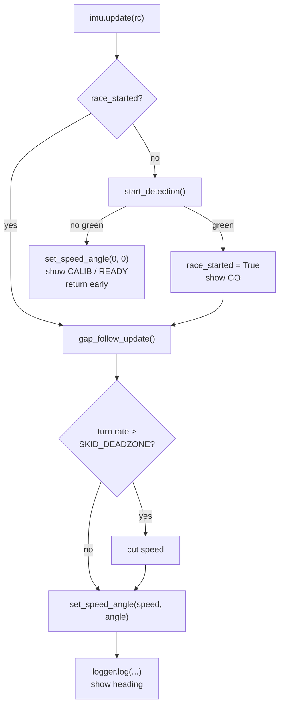

# BWSI RACECAR 2026 - TEAM 4 GRAND PRIX

> **Authorship note:** Jason Ma's laptop broke partway through, so most of us ended up working on Jason Zeng's machine. The git author name is usually whoever owned the computer, not whoever wrote the code. Whoever actually wrote it is in the commit description.

Our Grand Prix solution. The car waits at the line until it sees green, then runs the course on a gap follower, with an AHRS alongside it tracking heading and catching the car when it slides.

## Quick Start

```bash
# cd to your racecar folder first

git clone https://github.com/paul-sopin/team4-bwsiracecar-grandprix
cd team4-bwsiracecar-grandprix

# Run on the car
racecar sim grand_prix/grand_prix_AHRS.py
```

**Don't move the car for the first two seconds.** Gyro bias gets measured during the wait at the light. Bump it in that window and the heading is off for the whole run.

What the dot matrix is telling you:

| Shows | Means |
| :--- | :--- |
| `CALIB` | gyro still calibrating |
| `READY` | calibration done, waiting on green |
| `GO` | held about a second after the start |
| `-12` | live heading in degrees |

It's all abbreviated because the matrix is 8x24 and scrolls anything longer at about 2 characters a second.

## Repository Layout

| Path | Purpose |
| :--- | :--- |
| `grand_prix/grand_prix_AHRS.py` | Race script: start detection, gap follower, traction limiter, display |
| `grand_prix/ahrs.py` | AHRS: gyro bias calibration, heading, turn rate, roll and pitch |
| `grand_prix/telemetry.py` | Telemetry wrapper around `rc.telemetry`, plus the live debug HUD |
| `integration-challenges-progress.md` | Trial 4A tracker |
| `integration-challenges.png` | The Trial 4A challenge sheet |

---

## Architecture

One `racecar_core` script, no ROS. The AHRS is a plain Python class that `update()` calls directly, so there's nothing extra to launch at the start line.

We do have a real ROS 2 AHRS in the `state_estimation` package from Trial 2D, and it's the better estimator. It also needs a colcon build and a launch file already up before it does anything at all. Not worth it on race day.

What reads what:



And one frame of `update()`:



---

## Gap Follower
Andrew Pan, Jason Ma, Jason Zeng

Scans -90 to 90 a degree at a time and marks everything past `OPEN_THRESHOLD` as open. Longest continuous run of open angles wins, and the car steers at the average angle of that run. Speed comes off the average of the furthest left and right distances, so it opens up on straights and backs off when the course tightens.

We picked it off a decision matrix against Midline Tracking and EATS, scored on speed, consistency, ease to code, and efficiency:

- Gap Follower, 33
- EATS, 32
- Midline Tracking, 21

EATS was close enough that it could have gone either way.

There are two versions of the follower itself. V1 predates Speed Quest and splits the logic across helper functions, which reads better but is more of a pain to change. V2 was written during Speed Quest and is what's here.

## Start Detection
Paul Sopin

Crop the frame to the middle and lower region so the sky is out of it, HSV threshold for green inside that crop, take the largest contour, measure its area. Returns True only if there's a green contour and it's over `START_AREA_THRESHOLD`. Without that area check it'll trigger on anything green across the room.

## Dot Matrix
Andrew Pan

While `race_started` is False, every frame calls `start_detection()`. Big enough green contour and `race_started` flips True, the display shows GO, and the driving logic runs in that same frame. Otherwise the car gets forced to `set_speed_angle(0, 0)`, the display shows the calibration state, and the frame returns early.

It used to just say NOT STARTED, which wasn't worth much. Splitting that into CALIB and READY means we can watch the IMU finish calibrating before the race instead of hoping.

## Telemetry
Jason Zeng

You can't see how the proportional term is responding to steering error by watching the car drive around, and tuning the gap follower under a time limit means iterating faster than that. So: error over time, on a graph, with gains coming off a measurement instead of a guess.

The other option was streaming full LIDAR and camera to disk and rebuilding whole runs offline. That gives you far more to work with. It's also far more to build, and we didn't have the time.

`telemetry.py` wraps the built in `rc.telemetry`. `log()` reorders fields to match `FIELD_ORDER` and hands them to `rc.telemetry.record()`, and the graph comes out on exit. The race script logs gap angle, both wall distances, steering angle, speed, heading, and turn rate every frame.

`draw_hud()` draws a live readout with target angle, steering angle, speed, and a bar for where the controller is aiming. It doesn't run during the race. It's much wider than 8x24, so writing it every frame leaves the matrix permanently mid scroll. Use it on slow tuning runs. During a race the live view is `update_slow()` printing to the console once a second.

There used to be a CSV writer and a separate `analyze_telemetry.py` in here. `rc.telemetry` already does recording and graphing, so all of that is gone.

## AHRS
Jason Ma

First two seconds, average the gyro bias, then subtract it off every sample after that. Sitting completely still the gyro still reads a small nonzero rate, and integrating that drifts fast. The red light is free calibration time since we can't move anyway.

Yaw is the integral of yaw rate, wrapped to stay in -pi to pi. It's relative, so zero is wherever the car happened to be pointed at startup.

Roll and pitch go through a complementary filter, since the gyro is smooth but drifts and gravity is noisy but doesn't. `ACCEL_TRUST` is 0.02 because anything higher got jumpy. That's the only reason it's 0.02.

Worth knowing if you touch this file: the IMU axis order isn't the same on the car and in the sim. z is up on the car, y is up in the sim, so a hardcoded yaw index reads a completely wrong axis on one of the two platforms. `ahrs.py` works out which axis is vertical during calibration rather than assuming.

### Traction limiter

The gap follower picks speed off the open distance ahead, so it'll happily carry way too much into a corner. If the turn rate is higher than normal cornering should produce, we call that a slide and cut speed proportionally.

`SKID_DEADZONE` is where that line sits, and it's the constant we most need a real lap for. See Tuning.

## Tuning

| Constant | File | Effect |
| :--- | :--- | :--- |
| `OPEN_THRESHOLD` | `grand_prix_AHRS.py` | Distance that counts as open space |
| `GAP_TURN_KP` | `grand_prix_AHRS.py` | Steering gain toward the gap |
| `MIN_SPEED` / `MAX_SPEED` | `grand_prix_AHRS.py` | Speed envelope |
| `SKID_DEADZONE` | `grand_prix_AHRS.py` | Turn rate accepted as normal cornering |
| `SKID_KD` | `grand_prix_AHRS.py` | Braking strength per deg/s of excess |
| `CALIB_FRAMES` | `ahrs.py` | Calibration length, has to finish before green |
| `ACCEL_TRUST` | `ahrs.py` | Accelerometer weight in roll and pitch |

`update_slow()` prints speed, angle, wall distances, heading, turn rate, roll and pitch once a second. To set `SKID_DEADZONE`: drive a clean lap, watch the Turn rate line, and put the deadzone a bit above the highest number normal cornering gives you. Too low and it brakes in every corner. Too high and it still slides.

---

## Trial 4A Integration Challenges

| # | Challenge | Status |
| :--- | :--- | :--- |
| 1 | Waiting state, green light start | Done, `grand_prix_AHRS.py` |
| 2 | Dot Matrix Display utility | Done, calibration state, run state, live heading |
| 3 | Novel telemetry or debugging sequence | Done, `telemetry.py` with live HUD and post run graph |
| 4 | AHRS node or heading parameters | Done, `ahrs.py`, plus the Trial 2D ROS package |
| 5 | G-Splat with RealSense 435i | Not attempted |
| 6 | Occupancy grid of the track | Not attempted |
| 7 | Object detector influencing decisions | Built for Trial 3A, not wired into the race yet |
| 8 | Dynamic obstacle traversal | Attempt on race day |
| 9 | New sensor under $100 | Not attempted |

See [integration-challenges-progress.md](integration-challenges-progress.md)

---

## Known Issues

- The AHRS code in this repo has never actually been run. Every number below is a guess.
- `SKID_DEADZONE = 25.0` and `SKID_KD = 0.0022` are made up. We've never read a real turn rate off the car.
- The traction limiter only looks at how big the turn rate is, so it can't tell a slide apart from a genuinely tight corner and slows down for both. Real stability control compares the measured turn rate against what the steering angle and speed predict. Ours doesn't.
- No magnetometer in this filter, so heading is relative (the Trial 2D `attitude_node` does have one). Nothing steers off heading yet anyway, it's just on the display and in the console.
- Challenge 7 is close. `sign_detection/sn.py` already classifies signs and traffic lights and reacts to them, it's just in the other repo and nothing here calls it.
- `PABLO_TURN_KP`, `left_angle` and `right_angle` are dead. The last two print 0.0 every second.
