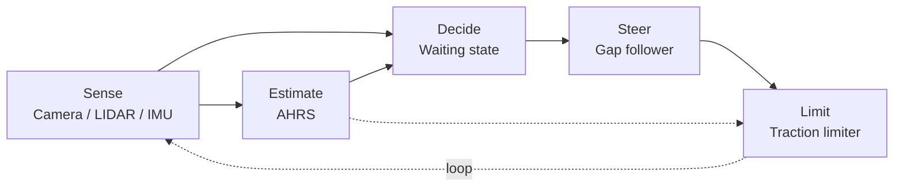
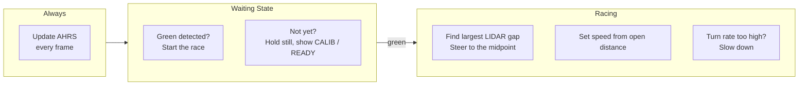

# BWSI RACECAR 2026 - TEAM 4 GRAND PRIX

> **Note on authorship:** Most of the team worked on Jason Zeng's computer, because Jason Ma's computer broke. This means the Git author name is often the owner of the machine and not the person who wrote the code. Whoever actually made the commit is listed in the description of the commit.

This is our autonomous solution for the Grand Prix. The car waits at the start line until it sees the stoplight turn green, then drives the course using a gap follower, with an AHRS running alongside it to measure heading and catch the car when it starts to slide.

## Quick Start

```bash
# cd to your racecar folder first

git clone https://github.com/paul-sopin/team4-bwsiracecar-grandprix
cd team4-bwsiracecar-grandprix

# Run on the car
racecar sim grand_prix/grand_prix_AHRS.py
```

The dot matrix shows CALIB while the gyro is calibrating, READY once it finishes, STARTED when green is detected, and the live heading after that.

Do not move the car for the first two seconds. The gyro bias is measured during the wait at the light, so if the car gets bumped in that window the heading will be off for the whole run.

## Repository Layout

| Path | Purpose |
| :--- | :--- |
| `grand_prix/grand_prix_AHRS.py` | Race script: start detection, gap follower, traction limiter, display |
| `grand_prix/ahrs.py` | AHRS: gyro bias calibration, heading, turn rate, roll and pitch |
| `grand_prix/telemetry.py` | Telemetry wrapper around `rc.telemetry`, plus the live debug HUD |
| `integration-challenges-progress.md` | Trial 4A tracker |
| `integration-challenges.png` | The Trial 4A challenge sheet |

---

## Architecture

Everything runs in one `racecar_core` script. The AHRS is a plain Python class that the update loop calls directly, so there is no ROS node and nothing extra to launch at the start line. We do have a full ROS 2 AHRS in the `state_estimation` package from Trial 2D, and it is the better estimator, but it needs a colcon build and a launch file running before it does anything. That is why it is not what races.



### Frame logic



---

## Gap Follower
Written by: Andrew Pan, Jason Ma, Jason Zeng

We compared three wall following algorithms (Midline Tracking, Gap Follower, and EATS) on a decision matrix scoring speed, consistency, ease to code, and efficiency. The Gap Follower scored highest at 33, with EATS close behind at 32 and Midline Tracking at 21, so we selected the Gap Follower for the Grand Prix as the best overall.

We also had two versions of the gap follower itself. Version 1 was written before Speed Quest and split the logic across several helper functions, which made it easier to read but more complex to work with. Version 2 was written during Speed Quest and is the one used here, because it is more concise and easier to understand.

How it works: the code scans from -90 to 90 degrees one degree at a time and marks every angle where the distance is above `OPEN_THRESHOLD` as open. It keeps the longest continuous run of open angles and steers at the average angle of that run. Speed is set from the average of the furthest left and right distances, so the car speeds up on straights and slows down when the course closes in.

## Start Detection
Written by: Paul Sopin

The frame is cropped to the middle and lower region so the sky is skipped. Green contours are found in that crop through HSV thresholding, the largest contour is taken, and its area is measured. It returns True only if a green contour exists and its area is over `START_AREA_THRESHOLD`, meaning the light is close enough to be real. If no green is found at all it returns False and the car stays still.

## Dot Matrix
Written by: Andrew Pan

While `race_started` is False, every frame calls `start_detection()`. If a large enough green contour is found, `race_started` is set to True, the display shows STARTED, and the driving logic runs in that same frame. If there is no green contour, or the contour is too small, the car is forced to `set_speed_angle(0, 0)`, the display shows the calibration state, and the frame returns early.

We extended this for the AHRS. Instead of only showing NOT STARTED while waiting, the display now shows CALIB while the gyro bias is still being measured and READY once it is done, so we can confirm the IMU is actually ready before the race starts. After the race begins the display shows the live heading in degrees.

## Telemetry
Written by: Jason Zeng

Tuning the gap follower requires fast iteration under a time limit, and watching the car drive does not show how the proportional term responds to steering error. We needed a way to look at controller error over time so gains could be chosen from measured response instead of guessing.

We considered two options. Logging and plotting records numeric sensor and controller values through a run and plots them afterward. Record and replay streams the full LIDAR and camera feeds to disk so the whole run can be rebuilt offline, which gives a more complete picture but is much harder to build and maintain.

We selected logging and plotting because it is less computationally heavy, creates less lag, and gives us a direct graph of error over time, which is what we need for tuning.

`telemetry.py` wraps the built in `rc.telemetry` module. `log()` reorders fields to match `FIELD_ORDER` and feeds them into `rc.telemetry.record()`, so the library can produce a time graph when the program exits. `draw_hud()` prints a live readout on the display with the target angle, steering angle, and speed, plus a bar showing where the controller is aiming relative to straight ahead. So during the run you get a live view, and after the run you get the full graph.

It used to have its own CSV writer and a separate `analyze_telemetry.py` script for plotting, but `rc.telemetry` already does recording and graphing, so all of that was removed. `rc.telemetry.visualize()` runs on exit and produces the graph on its own.

## AHRS
Written by: Jason Ma

For the first two seconds the filter averages the gyro bias, which is then subtracted from every later sample. Even sitting perfectly still the gyro reads a small nonzero rate, and integrating that produces a lot of drift, so this correction matters. The wait at the red light is free calibration time, because the car is not allowed to move yet.

After that, yaw is the integral of yaw rate, wrapped to stay between -pi and pi. Yaw is relative, so zero is wherever the car was pointed when it started.

Roll and pitch use a complementary filter. The gyro is smooth but drifts, while the accelerometer is jittery but does not drift, so the two are blended. `ACCEL_TRUST` is set to 0.02, because any higher and the output gets very jittery. This can be tuned later.

### Traction limiter

The gap follower sets speed from the open distance ahead, so it will carry a fast speed into a turn that the wheels cannot hold. If the turn rate is higher than what we expect from normal cornering, we know the car is slipping, so the speed is reduced proportionally.

`SKID_DEADZONE` is the turn rate we accept as normal. If it is set too low the car will slow down in every corner, and if it is set too high the car will still slip.

## Tuning

| Constant | File | Effect |
| :--- | :--- | :--- |
| `OPEN_THRESHOLD` | `grand_prix_AHRS.py` | Distance that counts as open space |
| `GAP_TURN_KP` | `grand_prix_AHRS.py` | Steering gain toward the gap |
| `MIN_SPEED` / `MAX_SPEED` | `grand_prix_AHRS.py` | Speed envelope |
| `SKID_DEADZONE` | `grand_prix_AHRS.py` | Turn rate accepted as normal cornering |
| `SKID_KD` | `grand_prix_AHRS.py` | Braking strength per degree per second of excess |
| `CALIB_FRAMES` | `ahrs.py` | Calibration length, must finish before green |
| `ACCEL_TRUST` | `ahrs.py` | Accelerometer weight in roll and pitch |

`update_slow()` prints speed, angle, wall distances, heading, turn rate, roll and pitch once per second. To set `SKID_DEADZONE`, drive a clean lap, read the Turn rate line, and set the deadzone just above the highest value normal cornering produces.

---

## Trial 4A Integration Challenges

| # | Challenge | Status |
| :--- | :--- | :--- |
| 1 | Waiting state, green light start | Done, `grand_prix_AHRS.py` |
| 2 | Dot Matrix Display utility | Done, calibration state, run state, live heading |
| 3 | Novel telemetry or debugging sequence | Done, `telemetry.py` with live HUD and post run graph |
| 4 | AHRS node or heading parameters | Done, `ahrs.py`, plus the Trial 2D ROS package |
| 5 | G-Splat with RealSense 435i | Not attempted |
| 6 | Occupancy grid of the track | Not attempted |
| 7 | Object detector influencing decisions | Built for Trial 3A, not wired into the race yet |
| 8 | Dynamic obstacle traversal | Attempt on race day |
| 9 | New sensor under $100 | Not attempted |

See [integration-challenges-progress.md](integration-challenges-progress.md)

---

## Known Issues

- The AHRS code in this repo has not been run yet, so none of the values below are measured.
- `SKID_DEADZONE = 25.0` and `SKID_KD = 0.0022` are starting guesses. We have not read a real turn rate off the car, so these need a tuning lap before the race.
- The traction limiter only looks at the size of the turn rate, so it cannot tell the difference between the car sliding and the car taking a genuinely tight corner. Both get slowed down. Proper stability control compares the measured turn rate against what the steering angle and speed predict, which ours does not do.
- Heading is relative and not absolute, because there is no magnetometer in this filter. The Trial 2D `attitude_node` does have one. Heading is currently only shown on the display and printed to the console, so nothing steers off it yet.
- Challenge 7 is close. `sign_detection/sn.py` already classifies signs and traffic lights and reacts to them, it just lives in the other repo and nothing here calls it.
- `PABLO_TURN_KP`, `left_angle`, and `right_angle` are unused. The last two print 0.0 every second.
